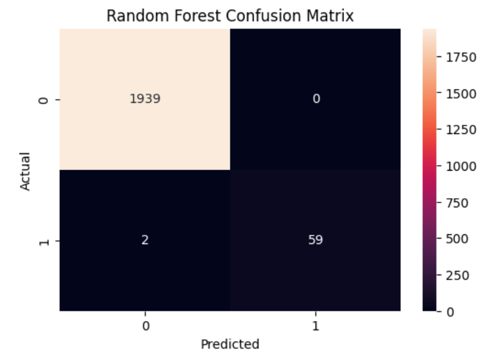
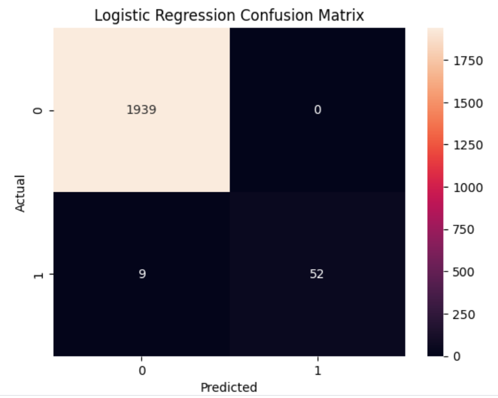
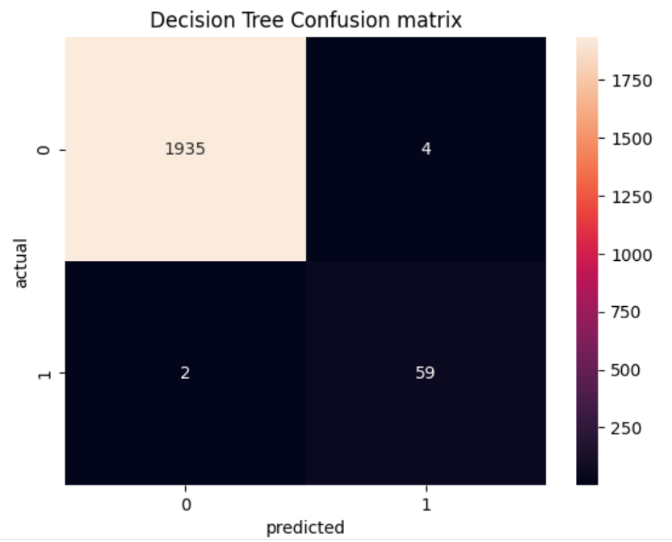
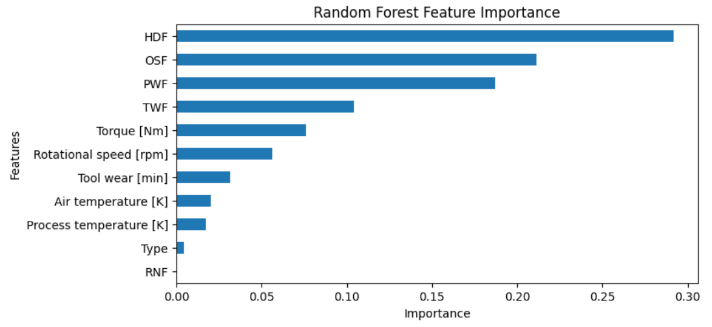
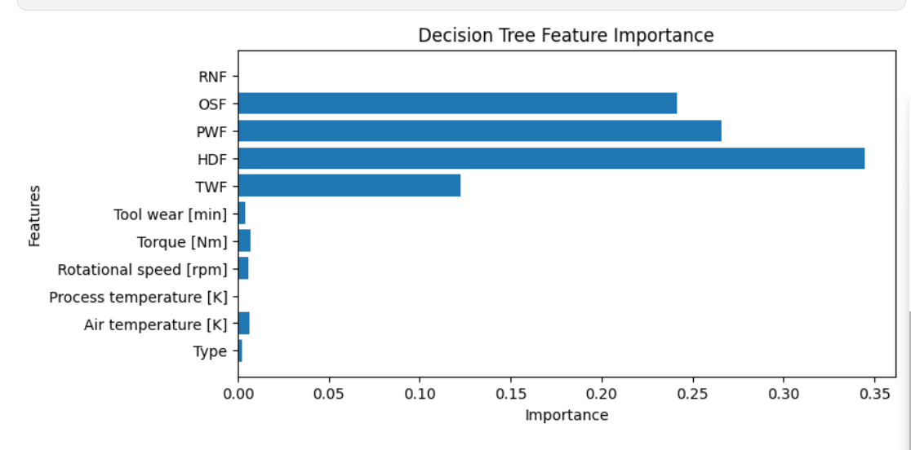

# Predictive Maintenance Project

## Overview
This project focuses on Predictive Maintenance using Machine Learning techniques.  
The objective is to predict machine failures before they occur by analyzing operational data and sensor readings.

## Dataset
The dataset contains machine operating parameters such as:
- Air temperature
- Process temperature
- Rotational speed
- Torque
- Tool wear

## Technologies Used
- Python
- Pandas
- NumPy
- Matplotlib
- Seaborn
- Scikit-learn

## Machine Learning Algorithms
The following algorithms were used:
- Logistic Regression
- Random Forest Classifier
- Decision Tree Classifier

## Project Workflow
1. Data Collection
2. Data Preprocessing
3. Exploratory Data Analysis
4. Feature Selection
5. Model Training
6. Model Evaluation
7. Failure Prediction

## Results
The machine learning model successfully predicts machine failures with good accuracy and performance.

## Project Screenshots
### Random Forest Confusion Matrix

### Logistic Regression Confusion Matrix

### Decision Tree Confusion Matrix

### Random forest Feature Importance Graph

### Decision tree Feature Importance Graph

## Files Included
- Predictive_Maintenance.ipynb
- Dataset files
- Output graphs and visualizations

## Conclusion
Predictive maintenance helps industries reduce downtime, improve efficiency, and lower maintenance costs by predicting failures in advance.

## Author
Varshini Nalla
